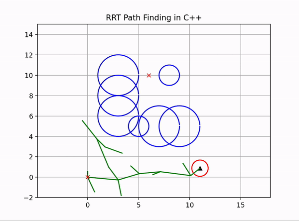

# Path Planning Algorithms in C++

For some algorithms, such as RRT, a lot of inspiration comes from AtsushiSakai's tutorials found [here](https://github.com/AtsushiSakai/PythonRobotics).

## Currently Implemented Algos 
1. BFS
2. Dijkstras
3. A*
4. RRT (Rapidly-exploring random tree)

## Currently in progress
1. Hybrid A*
2. RRT*
## Showcase

### RRT

